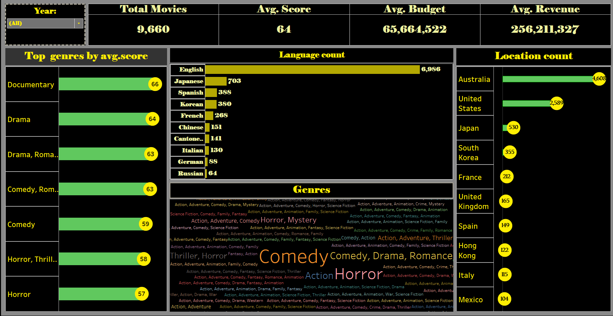
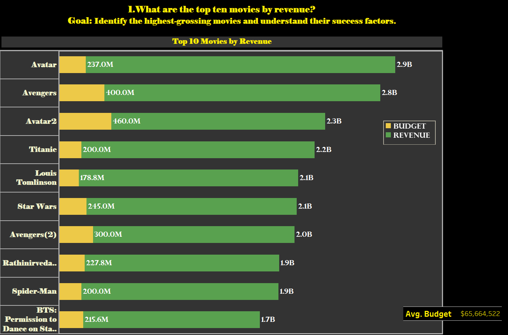
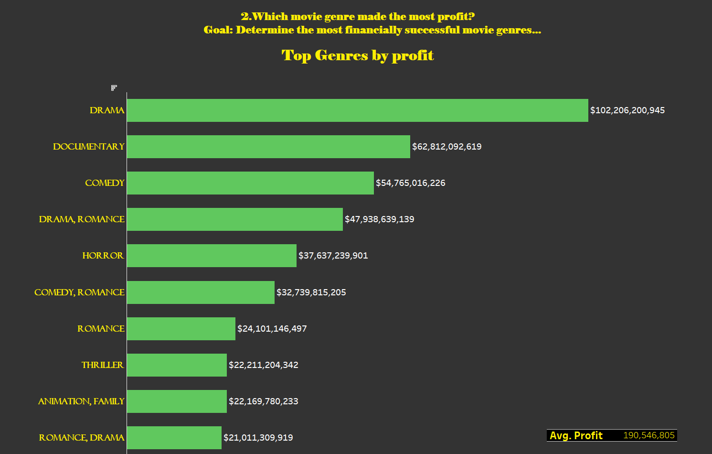
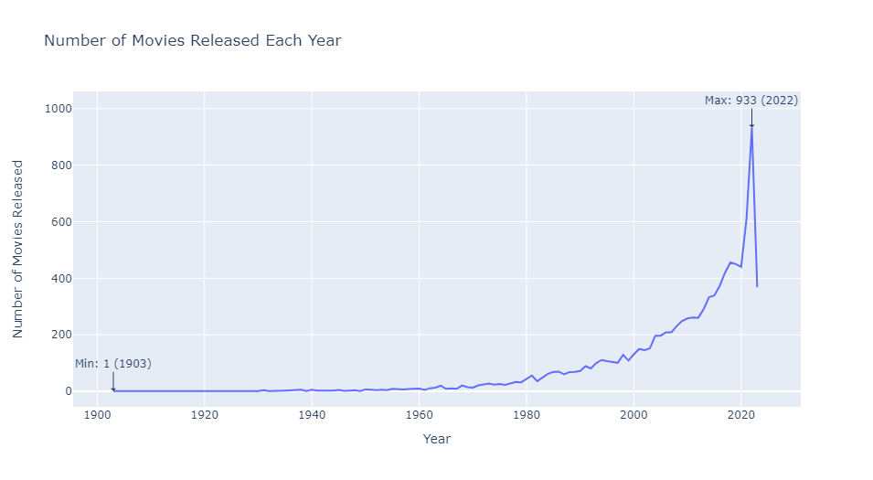
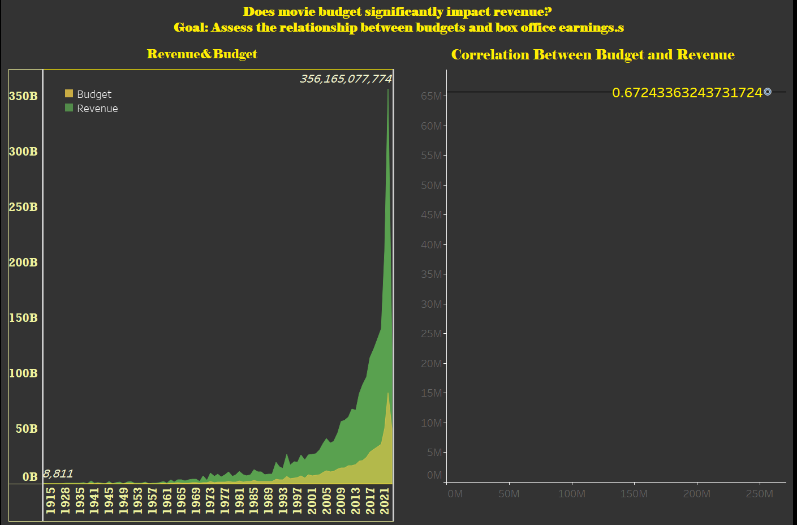
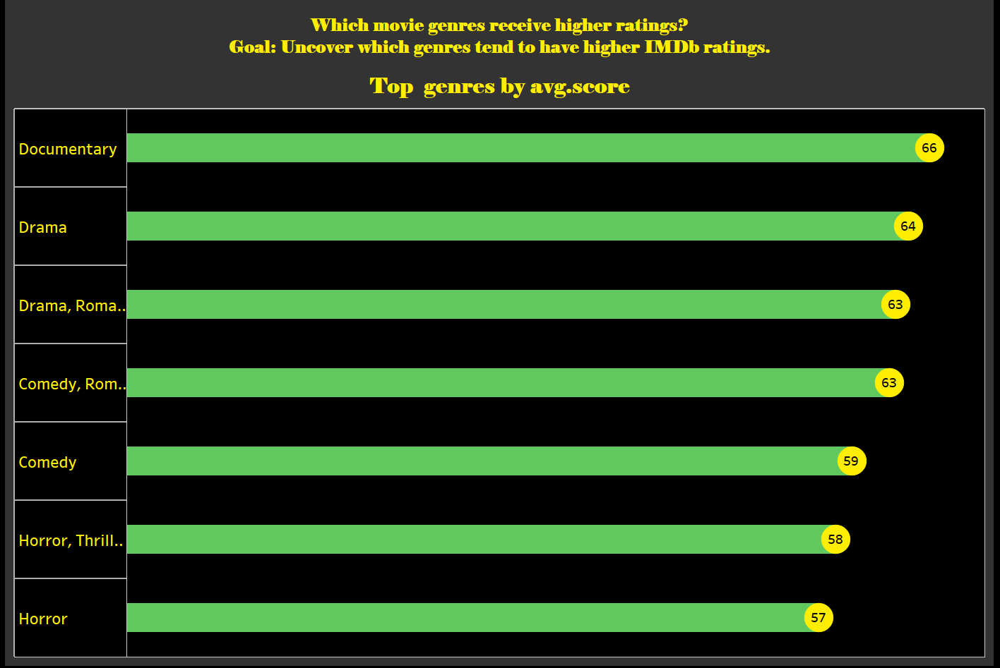
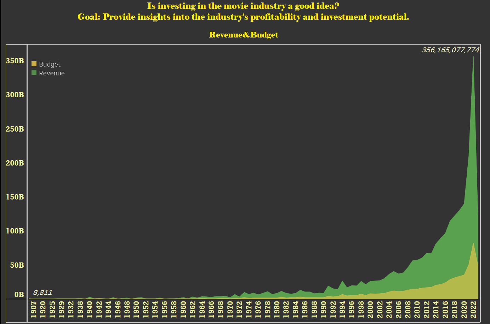
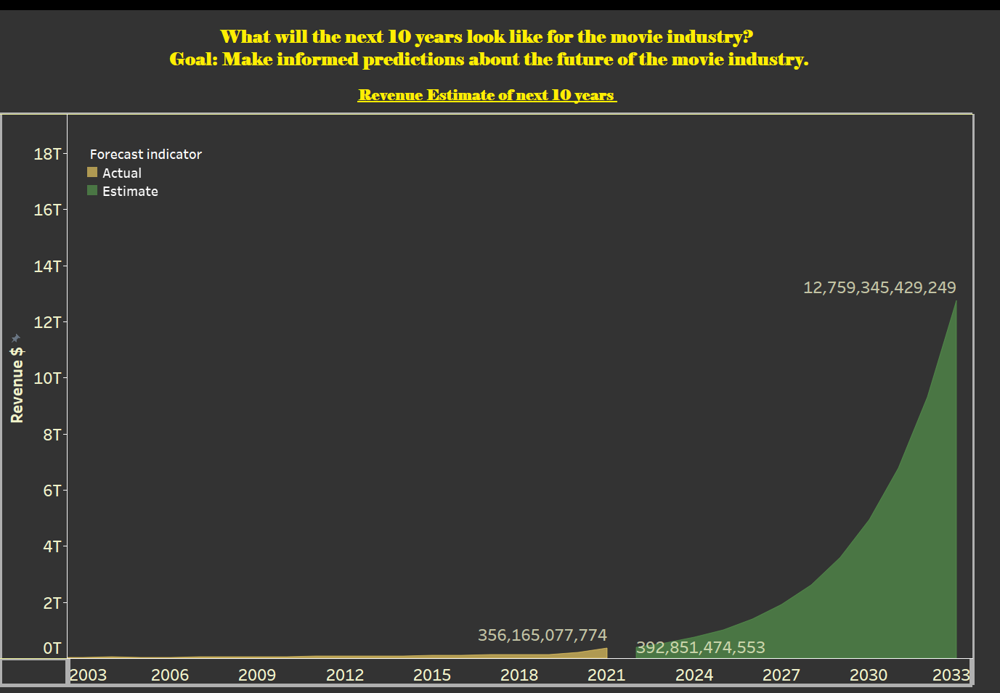
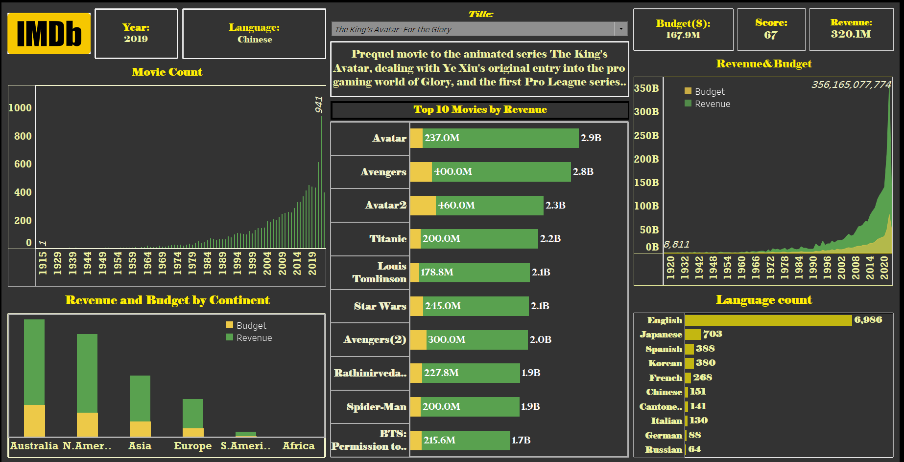

# Analysis of Imdb Movies

# Introduction
The IMDB dataset is gotten from kaggle *[here](https://www.kaggle.com/datasets/ashpalsingh1525/imdb-movies-dataset)*. it originally contains information about movies, including their names, release dates, user ratings(score), genres, overviews, cast and crew members, original titles, production status, original languages, budgets, revenues, and countries of origin. having 10178 rows & 12 columns originally and 9660 rows & 14 columns after data cleaning and manipulation. Data cleaning and manipulation is done with **python** and visualization is done with both **python** and **Tableau**. [cleaning proccess](Imdb_movies_python.ipynb)
# Goals and Objective
My goals are to provide insight, by answering the following questions:

1. **What are the top ten movies by revenue?**
   - Goal: Identify the highest-grossing movies and understand their success factors.

2. **Which movie genre generates the most revenue?**
   - Goal: Determine the most financially successful movie genres.

3. **In which year were the most movies produced?**
   - Goal: Discover the peak year for movie production and industry trends.

4. **Does movie budget significantly impact revenue?**
   - Goal: Assess the relationship between budgets and box office earnings.

5. **Which movie genres receive higher ratings?**
   - Goal: Uncover which genres tend to have higher IMDb ratings.

6. **Is investing in the movie industry a good idea?**
   - Goal: Provide insights into the industry's profitability and investment potential.

7. **What will the next 10 years look like for the movie industry?**
   - Goal: Make informed predictions about the future of the movie industry.

8. **How can you interact with the data?**
   - Goal: Develop an interactive dashboard for user engagement and exploration.

**By addressing these questions, I aim to offer a comprehensive analysis of the IMDb movie dataset.**

# Skills and Methods Demonstrated:

- **Data Cleaning:** Demonstrated proficiency in cleaning data. [check them here](Imdb_movies_python.ipynb).
- **Data Visualization:** Employed data visualization techniques and tools such as Matplotlib, Seaborn, and Tableau to create informative and visually appealing charts, graphs, and dashboards.
- **Statistical Analysis:** Conducted statistical analysis to uncover trends, correlations, and insights within the dataset.
- **Dashboard Creation:** Designed interactive dashboards in Tableau to allow users to explore data and gain insights through visual exploration.
- **Data Visualization Best Practices:** Followed best practices in data visualization, including choosing appropriate chart types, color schemes, and labels to enhance data clarity.
- **Project Documentation:** Documented the data cleaning, manipulation, and visualization process for transparency and reproducibility [check them here](Imdb_movies_python.ipynb).
- **Communication:** Effectively conveyed the results of data analysis and visualization to both technical and non-technical audiences.
- **Domain Knowledge:** Demonstrated understanding of the movie industry and domain-specific factors that impact movie success.
- **Predictive Modeling (if applicable):** performed predictive modeling or forecasting, using tableau.
  
# Visualization:
## This Analysis comprises of 9 visuals
 - **Overview Dashboard [interact here](https://public.tableau.com/app/profile/gideon.oluwafemi/viz/project_16933854279020/Story1?publish=ye)**
 - **Top 10 movies by revenue**
 - **Genres with most profit**
 - **Year with most movie**
 - **Impact of Budget on revenue generated**
 - **Movie Genre with most rating**
 - **Movie industry good or bad investment**
 - **what the net 10 years will look like**
 - **Lastly, an interactive dashboard**

 
# **1. Overview Dashboard [interact here](https://public.tableau.com/app/profile/gideon.oluwafemi/viz/project_16933854279020/Story1?publish=ye)**
 
 

# 2. **What are the top ten movies by revenue?**
- **Goal:** Identify the highest-grossing movies and understand their success factors.
  - **Chart Explanation:**
Yellow bars show movie budgets.
Green bars show movie revenues.
 - **Key Insight:**
From our dataset the most noticeable pattern is that the top 10 highest-grossing movies had much higher budgets compared to the average budget for all movies, which is around $65.66 million.
 - **Implication:**
Big budgets seem to be a key factor in a movie's success.
 
 

# 3. **Which movie genre made the most profit?** 
- **Goal:** Determine the most financially successful movie genres.
- **Key Findings:**
Drama is the most financially successful genre, making around $102 billion in profit.
Documentary comes next with about $62.8 billion in profit.
Comedy follows with $54.7 billion in profit.
Other profitable genres include romance drama, horror, comedy romance, romance, thriller, animation family, and romance drama.
 

# 4. **In which year were the most movies produced?** 
**- Goal:** Discover the peak year for movie production and industry trends.
**Insights:**
The year with the most movies produced is 2022, with 933 movies.
Back in 1900, there was only one movie produced.
Over the years, there has been a steady increase in movie production, showing a growing trend in the industry.

# 5. **Does movie budget significantly impact revenue?** 
- **Goal:** Assess the relationship between budgets and box office earnings.
-  **Chart Insights:** In the first chart, yellow shows the budget, and green shows revenue.
When budgets go up, revenue tends to go up as well.
In 2022, a small budget increase led to a big revenue boost making the sum of revenue generated reach it all time high of $356billion 
 - **Correlation Explanation:**
 The correlation between Budget and Revenue is 0.67, indicating a moderately strong positive relationship between these two variables. this indicates that as the budget of a movie increases, there is a tendency for its revenue to also increase
In simple terms, spending more on a movie often leads to higher earnings.

# 6. **Which movie genres receive higher ratings(score)?** 
- **Goal:** Uncover which genres tend to have higher IMDb ratings(score).
- Rating is a score or grade that reflects how good or enjoyable a movie is to it audience. It helps viewers decide if a movie is worth watching.
- **Chart Insights:** From our chart, we see that documentary, drama, and drama romance genres came in first, second, and third.
Their average ratings were 66, 64, and 63, respectively.
Following closely were comedy romance, comedy horror, and horror thriller genres.

# 7. **Is investing in the movie industry a good idea?**
  **- Goal:** 
  Provide insights into the industry's profitability and investment potential.
  **-  Chart Insights:**
In the area chart, yellow represents the budget, and green represents revenue.
As the years go by, both budget and revenue increase.
Importantly, there's no year where the budget exceeds the revenue.
This suggests that, on average, movies generate more revenue than their budgets.
While it doesn't guarantee profits every year, it shows a trend of more revenue than budget.
So, investing in the movie industry seems like a good idea because, over time, movies tend to generate more money than they cost to produce.

# 8. **What will the next 10 years look like for the movie industry?**
**- Goal:** Make informed predictions about the future of the movie industry.
**Chart Insights:**
In the chart, yellow represents actual data, and green represents predictions.
In 2022, the industry generated $356 billion in revenue.
It's estimated that by the end of 2023, revenue will reach $392 billion.
The exciting part is the prediction for the next 10 years (up to 2033).
It suggests that in the next decade, the movie industry could generate a whopping $12 trillion in revenue.
This is a significant and positive outlook for the movie industry, indicating substantial growth ahead.

# 9. **How can you interact with the data?** **[interact here](https://phttps://github.com/ogeleka/Imdb_movies/blob/main/Next_10%20years.11.pngublic.tableau.com/app/profile/gideon.oluwafemi/viz/project_16933854279020/Story1?publish=ye)**
 **Goal:** Create an interactive dashboard for users to explore and engage with the data.
**Purpose:**
The dashboard is designed to provide the audience with detailed insights into the dataset.
Users can interact with the dashboard to gain a better understanding of the data and explore it in-depth

# Conclusion:
Our analysis of the IMDb movie dataset reveals that big budgets often lead to higher movie revenue. Genres like drama and documentary are consistently profitable and receive favorable ratings. The industry is on a growth trajectory, with increasing movie production each year.

# Recommendation:
Considering the industry's positive outlook, investing in the movie sector can be lucrative. However, thorough research and strategic budget management are essential. Collaborative ventures and partnerships, especially within profitable genres, offer promising opportunities.

**In summary**, the movie industry is evolving with potential for growth. Explore our interactive dashboard for deeper insights.

**thank you😊.**
